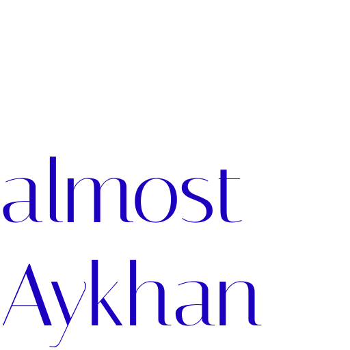
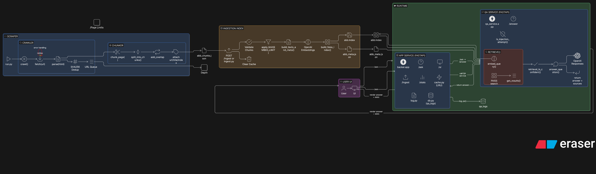

<!-- ⚠️ README generated for ABB RAG case study ⚠️ -->

[](#-almostaykhan)

<p align="left"></p>

### **ABB Q&A Retrieval-Augmented Assistant**

**ABB site scraping → Chunking → FAISS retrieval → Guardrails → GPT answers → Web UI + stats**

<p align="center">
  
  
  
  
  
  
</p>


---

[](#-what-is-almostaykhan)

## ➤ ⚡ What is almostAykhan?
A focused RAG system that answers questions **only** from ABB Bank’s public content. It scrapes ABB pages, chunks and embeds them, builds a FAISS index, and serves a multilingual chat UI with strict guardrails (Azerbaijani, English, Russian). Out-of-scope questions return \"Bunu bilmirəm.\"

---

[](#-why-it-stands-out)

## ➤ ✨ Why it stands out
- **Context-only replies** with injection + distance gates and language-aware prompt.
- **Pre-scraped data**: deterministic, no live crawl dependency at question time.
- **Two-process split**: `app` gateway + `qa` retrieval/LLM microservice.
- **Upload-to-ingest**: UI can upload JSON chunks, store in browser, send to backend ingest.
- **Observability**: questions/answers logged to SQLite, visualized via Chart.js in UI.
- **Negative + positive black-box suites** to prove guardrails.

---

[](#-design-decisions)

## ➤ 🧠 Design Decisions
| Decision | Why |
|---|---|
| **FAISS L2 (IndexFlatL2)** | Simple, fast vector search; distance gate (`RETRIEVAL_MAX_DISTANCE`) blocks weak matches. |
| **Multilingual prompt + injection list (AZ/EN/RU)** | Prevents prompt override and keeps answers in user language. |
| **Separated QA service** | Lets retrieval/LLM scale or swap independently from API/DB/UI. |
| **SQLite logs** | Zero-config persistence for demo; ready to swap to Postgres. |
| **LocalStorage upload** | Meets “user-provided data upload” requirement without extra backend state. |

---

[](#-architecture)

## ➤ 🏗️ Architecture
<p align="center">
  
</p>

<p align="center">
Architecture diagrams were made with [Eraser](https://app.eraser.io/)!
</p>

---

[](#-services)

## ➤ 🧩 Services
| Service | Port | Purpose |
|---|---:|---|
| `qa` | 8001 | Guarded retrieval + LLM answers (FastAPI `qa_service/qa.py`). |
| `app` | 8000 | Public API + UI hosting + logging + cache + ingest proxy (FastAPI `backer/app.py`). |

Shared volume: `./backer/data` (FAISS + meta) and `./scraper/output` (chunks JSON).

---

[](#-quickstart)

## ➤ 🚀 Quickstart (Docker)
```bash
docker compose up -d --build
```
Env: set `OPENAI_API_KEY` (in shell or `.env`).
Open UI: http://localhost:8000/ui/

---

[](#-local-dev)

## ➤ 🧑‍💻 Local dev (no Docker)
Prereqs: Python 3.11, `OPENAI_API_KEY` in env.

```bash
python -m venv .venv
source .venv/bin/activate
pip install -r requirements.txt

1) Scrape ABB
python -m scraper.run  # writes scraper/output/abb_chunks.json

2) Start QA service (port 8001)
uvicorn qa_service.qa:app --host 0.0.0.0 --port 8001

3) Start APP gateway/UI (port 8000)
uvicorn backer.app:app --host 0.0.0.0 --port 8000

4) Ingest chunks (once services are up)
curl -s -X POST http://127.0.0.1:8000/ingest \
  -H "Content-Type: application/json" \
  --data-binary @scraper/output/abb_chunks.json
```
---

[](#-workflow)

## ➤ 🔄 Workflow (end to end)
1) **Scrape**: `python -m scraper.run` → `scraper/output/abb_chunks.json`.
2) **Ingest**: `POST /ingest` or UI upload → embeds, builds FAISS, saves `backer/data/abb.index`, `abb_meta.json`, clears cache.
3) **Ask**: UI `Ask` → `app` cache/log → `qa` guardrails → retrieve (FAISS) → distance gate → GPT response → return answer + sources.
4) **Stats**: `GET /stats` feeds Chart.js questions-per-day graph.

---

[](#-api)

## ➤ 🧾 API (app service)
- `GET /health` → `{ "sagligdi": true }`
- `POST /ask` `{ "question": "..." }` → `{ answer, sources[] }`
- `POST /ingest` body: abb_chunks JSON array → `{ "status":"ok" }` (rebuilds index)
- `GET /stats` → aggregated counts by day
- Static UI at `/ui`

`qa` service: `POST /answer` (internal) same payload; applies guards + retrieval.

---

[](#-guardrails)

## ➤ 🛡️ Guardrails
- **Prompt injection blocklist** (AZ/EN/RU) checked pre-retrieval.
- **Distance gate**: reject answers if best FAISS distance > `RETRIEVAL_MAX_DISTANCE` (default 1.35) → "Bunu bilmirəm."
- **Context-only prompt**: translate context to question language, forbid speculation, multilingual compliance.
- **Out-of-scope suites**: 20 negative cURL tests ensure OOS → "Bunu bilmirəm."

---

[](#-tech-stack)

## ➤ 🧠 Tech Stack
- **Python 3.11**, **FastAPI**, **httpx**, **pydantic**
- **OpenAI** `gpt-4o-mini` for answers, `text-embedding-3-large` for vectors
- **FAISS** `IndexFlatL2`
- **Chart.js** for frontend stats
- **SQLite** for Q/A logs
- **Docker Compose** for app + qa services

---

[](#-env)

## ➤ 🧩 Env & data
- **Env vars**: `OPENAI_API_KEY` (required); `QA_SERVICE_URL` (optional, defaults to http://127.0.0.1:8001/answer locally / set in compose); `RETRIEVAL_MAX_DISTANCE` (default 1.35); `TOP_K` (default 10).
- **Data files (post-ingest)**: `backer/data/abb.index`, `backer/data/abb_meta.json`, `scraper/output/abb_chunks.json`.
- **Known limits**: distance gate 1.35; cache is in-memory only; Q/A logs in SQLite.

---


## ➤ 🗂️ Repo Map
- `scraper/` — crawl + parse + chunk ABB content → `output/abb_chunks.json`
- `backer/` — gateway API, ingest, logging, cache, config
  - `routes/` — `ask.py`, `ingest_route.py`, `stats.py`, `health.py`
  - `core/` — `guards.py`, `llm.py`, `cache.py`
  - `data/` — FAISS index + meta (post-ingest)
- `qa_service/qa.py` — retrieval + LLM service
- `fronter/` — static UI (Azerbaijani) with Chart.js
- `docker/` — `Dockerfile.backer`
- `docker-compose.yml` — runs `app` and `qa`
- `backer/BLACK-BOX-TEST-RESULTS/` — saved negative test outputs

---

[](#-deployment)

## ➤ ☁️ Deployment
1) Set `OPENAI_API_KEY` in shell or `.env`.
2) `docker compose up -d --build`
3) Open UI at http://localhost:8000/ui/

---

[](#-whats-next)

---

## ➤ Authors

- [Riad Mukhtarov](https://www.linkedin.com/in/riadmukhtarov/)

---
## ➤ License

[MIT](https://choosealicense.com/licenses/mit/)
